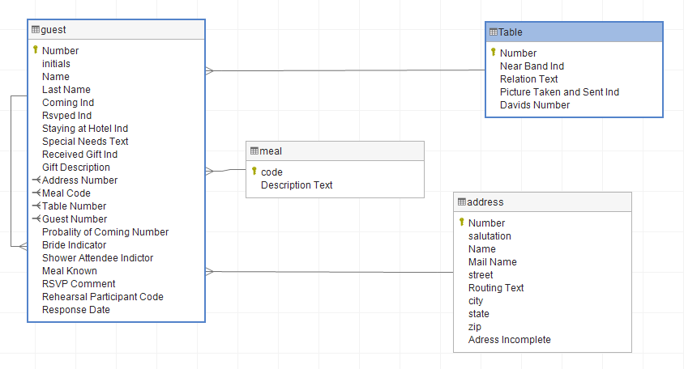

# Datamodeling
This repository contains some data modeling which I've done with some databases which I have made from scratch in my postgres Database. I have used "Dataedo" modeling tool to develop ERD diagrams to explain the relationships between different entities.

# Data model of my company's first organizational heirarchy:

# Data model of a disease database:

# Data model of a flights database:

# Data model of a rockin database:

# Data model of a wedding database:

